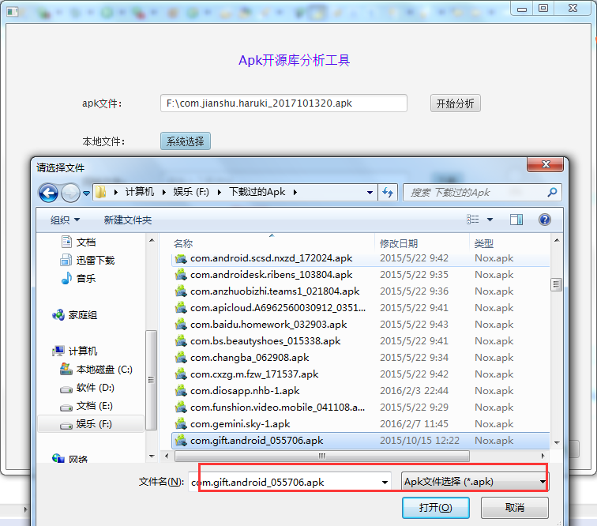
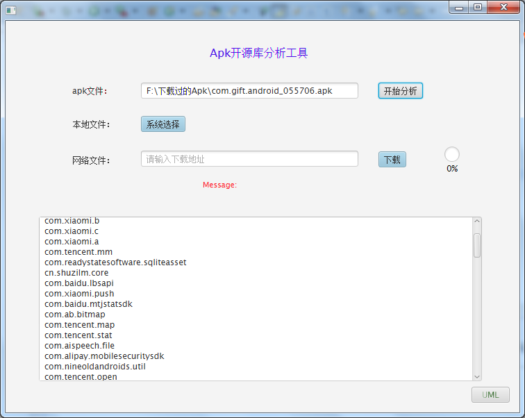
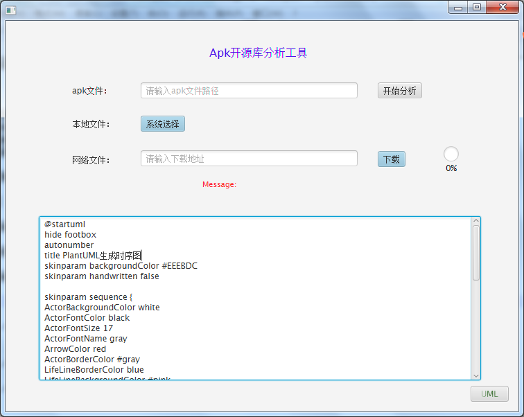
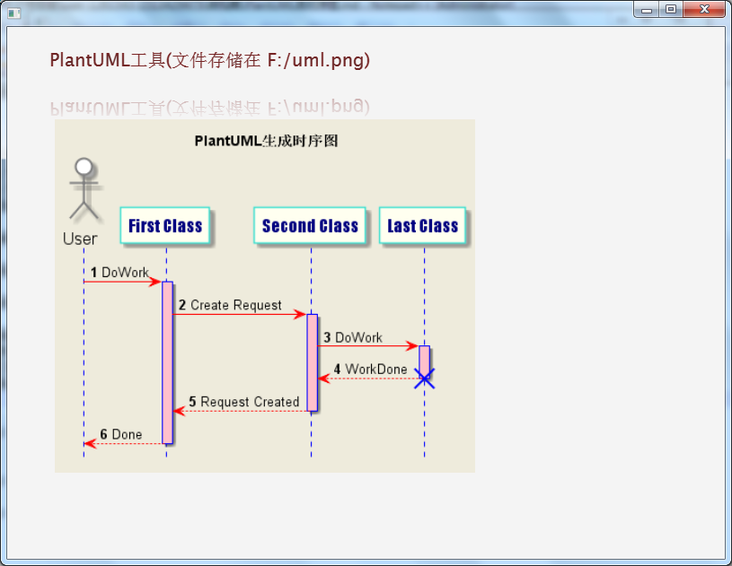

# Apkparser
## 前言
Android开发中的技术选型，针对某一领域的App，看看某些主流App是如何解决的，是自己解决还是使用开源框架。
有的框架非常优秀但却不为人所知，现在是大数据时代，各种杂乱的信息，很多信息都不是我们需要的。

虽然不鼓励这两种行为:

1. 只做API的调用者
2. 造重复的轮子

但是**某些框架**的原理是必须深入的理解的，同样地，更多的框架如**UI类型的开源库**不建议花费过多的时间去自己研究。
毕竟人的精力是有限的，我们把有限的精力花费在更有价值的事情上，而不是重复的劳动力。
该 **小工具** 就是为了快速寻找到成熟优秀的框架，学习其使用的同时，更好地学习其优秀的设计，解析某个App时，也许会有
意外的收获，这也是我前期不断花费大量精力学习一些杂乱的技术不断磨刀到现在的初衷，为了后期少走弯路，更快的进步....


该项目的代码不值一提，因为硬盘多次坏掉，仅做备份使用，为省事把PlantUML和ApkParser工具合并在了一起。
JavaFX实在太容易了，相对Android和Swing而言，Api简洁好用，缺点就是build成exe的时候包实在太大了，60M左右，所以仅仅上传了可运行的Jar，
你只需要 `antbuild/dist` 目录中的文件下载下来即可运行(确保JRE已安装)。

> tips
项目代码就无需研究了，UI只用了一个类，没什么可看的，不过JavaFX值得一看，如果你懂Android，仅需一天即可掌握基础。

## 项目截图



----------------------------------------------



----------------------------------------------



----------------------------------------------



----------------------------------------------

导入简书apk为例:

```
================================
packageName: 	com.jianshu.haruki
label: 	简书
icon: 	res/mipmap-hdpi-v4/jianshu_icon.png
versionName: 	3.2.0
versionCode: 	2017101320
minSdkVersion: 	14
targetSdkVersion: 	23
maxSdkVersion: 	null
================================
<?xml version="1.0" encoding="utf-8"?>
<manifest xmlns:android="http://schemas.android.com/apk/res/android" android:versionCode="2017101320" android:versionName="3.2.0" package="com.jianshu.haruki" platformBuildVersionCode="25" platformBuildVersionName="7.1.1">
	<uses-sdk android:minSdkVersion="14" android:targetSdkVersion="23" />
	<uses-permission android:name="android.permission.INTERNET" />
	<uses-permission android:name="android.permission.WRITE_EXTERNAL_STORAGE" />
	<uses-permission android:name="android.permission.READ_EXTERNAL_STORAGE" />
	<uses-permission android:name="android.permission.ACCESS_NETWORK_STATE" />
	<uses-permission android:name="android.permission.ACCESS_WIFI_STATE" />
	<uses-permission android:name="android.permission.MOUNT_UNMOUNT_FILESYSTEMS" />
	<uses-permission android:name="android.permission.READ_PHONE_STATE" />
	<uses-permission android:name="android.permission.WAKE_LOCK" />
	<uses-permission android:name="android.permission.RECEIVE_BOOT_COMPLETED" />
	<uses-permission android:name="android.permission.VIBRATE" />
	<uses-permission android:name="android.permission.GET_TASKS" />
	<uses-permission android:name="android.permission.MANAGE_ACCOUNTS" />
	<uses-permission android:name="android.permission.CHANGE_WIFI_STATE" />
	<uses-permission android:name="android.permission.BLUETOOTH" />
	<uses-permission android:name="android.permission.BLUETOOTH_ADMIN" />
	<uses-permission android:name="android.permission.READ_LOGS" />
	<uses-permission android:name="com.android.launcher.permission.INSTALL_SHORTCUT" />
	<uses-permission android:name="android.permission.CAMERA" />
	<uses-permission android:name="getui.permission.GetuiService.com.jianshu.haruki" />
	<permission android:name="getui.permission.GetuiService.com.jianshu.haruki" android:protectionLevel="0x0" />
	<permission android:name="com.jianshu.haruki.permission.MIPUSH_RECEIVE" android:protectionLevel="0x2" />
	<uses-permission android:name="com.jianshu.haruki.permission.MIPUSH_RECEIVE" />
	<uses-permission android:name="oppo.permission.OPPO_COMPONENT_SAFE" />
	<uses-permission android:name="android.permission.SYSTEM_ALERT_WINDOW" />
	<uses-permission android:name="android.permission.WRITE_SETTINGS" />
	<uses-permission android:name="com.google.android.c2dm.permission.RECEIVE" />
	<permission android:name="com.jianshu.haruki.permission.C2D_MESSAGE" android:protectionLevel="0x2" />
	<uses-permission android:name="com.jianshu.haruki.permission.C2D_MESSAGE" />
	<application android:theme="resourceId:0x7f0901d6" android:label="简书" android:icon="res/mipmap-hdpi-v4/jianshu_icon.png" android:name="com.baiji.jianshu.JSMainApplication" android:allowBackup="false" android:hardwareAccelerated="false" android:largeHeap="false" android:supportsRtl="false">
		<meta-data android:name="JIANSHU_BUILD_TIMESTAMP" android:value="2017-12-19 18:49:36" />
		<meta-data android:name="android.max_aspect" android:value="{4:1074161254}" />
		<provider android:name="com.baiji.jianshu.db.core.JianshuProvider" android:exported="false" android:authorities="com.jianshu.haruki.provider" />
		<activity android:theme="resourceId:0x7f09016e" android:name="com.baiji.jianshu.ui.splash.SplashScreenActivity" android:screenOrientation="portrait" android:windowSoftInputMode="0x20">
			<intent-filter>
				<action android:name="android.intent.action.MAIN" />
				<category android:name="android.intent.category.LAUNCHER" />
			</intent-filter>
		</activity>
		<activity android:theme="resourceId:0x7f090165" android:label="简书" android:name="com.baiji.jianshu.ui.home.main.MainActivity" android:launchMode="singleTask" android:screenOrientation="portrait" android:configChanges="0x4a0" android:windowSoftInputMode="0x2">
			<intent-filter>
				<category android:name="android.intent.category.DEFAULT" />
				<category android:name="android.intent.category.BROWSABLE" />
				<action android:name="android.intent.action.VIEW" />
				<data android:scheme="jianshu" android:host="homepage" />
			</intent-filter>
		</activity>
		<activity android:label="保存为私密文章" android:name="com.baiji.jianshu.ui.editor.EditorActivity" android:launchMode="singleTop" android:screenOrientation="portrait" android:windowSoftInputMode="0x14">
			<intent-filter>
				<category android:name="android.intent.category.LAUNCHER" />
				<action android:name="android.intent.action.CREATE_SHORTCUT" />
			</intent-filter>
		</activity>
		<activity android:theme="resourceId:0x7f090165" android:label="保存为私密文章" android:name="com.baiji.jianshu.ui.editor.EditorActivityV19" android:launchMode="singleTop" android:screenOrientation="portrait" android:configChanges="0x40002fff" android:windowSoftInputMode="0x10">
			<intent-filter>
				<action android:name="android.intent.action.SEND" />
				<category android:name="android.intent.category.DEFAULT" />
				<data android:mimeType="text/plain" />
			</intent-filter>
			<intent-filter>
				<category android:name="android.intent.category.LAUNCHER" />
				<action android:name="android.intent.action.CREATE_SHORTCUT" />
			</intent-filter>
		</activity>
		<activity android:label="选择文集" android:name="com.baiji.jianshu.ui.editor.SelectNoteBookActivity" android:screenOrientation="portrait" android:windowSoftInputMode="0x12" />
		<activity android:name="com.baiji.jianshu.ui.articledetail.comment.CommentDialogActivity" android:screenOrientation="portrait" android:windowSoftInputMode="0x10" />
		<activity android:name="com.baiji.jianshu.ui.articledetail.ArticleImagePreviewActivity" android:screenOrientation="locked" android:windowSoftInputMode="0x12" />
		<activity android:label="通知" android:name="com.baiji.jianshu.activity.NotifyDetailActivity" android:screenOrientation="portrait" android:windowSoftInputMode="0x20">
			<intent-filter>
				<category android:name="android.intent.category.DEFAULT" />
				<category android:name="android.intent.category.BROWSABLE" />
				<action android:name="android.intent.action.VIEW" />
				<data android:scheme="jianshu" android:host="notifications" />
			</intent-filter>
		</activity>
		<activity android:label="对话" android:name="com.baiji.jianshu.activity.ChatMessagesActivity" android:screenOrientation="portrait" android:windowSoftInputMode="0x12" />
		<activity android:label="选择联系人" android:name="com.baiji.jianshu.ui.messages.chat.ChatUsersActivity" android:screenOrientation="portrait" />
		<activity android:label="选择联系人" android:name="com.baiji.jianshu.ui.messages.chat.SearchChatUserActivity" android:screenOrientation="portrait" android:windowSoftInputMode="0x24" />
		<activity android:label="投稿推荐" android:name="com.baiji.jianshu.ui.articledetail.submission.SubmissionRecommendActivity" android:screenOrientation="portrait" android:windowSoftInputMode="0x3" />
		<activity android:label="投稿管理" android:name="com.baiji.jianshu.ui.articledetail.submission.SubmissionManageActivity" android:screenOrientation="portrait" android:windowSoftInputMode="0x3" />
		<activity android:label="发布分享" android:name="com.baiji.jianshu.ui.editor.ReleaseNoteShareActivity" android:screenOrientation="portrait" />
		<activity android:label="全部关注" android:name="com.baiji.jianshu.ui.subscribe.addsubscribe.AllSubscribedNotesActivity" android:screenOrientation="portrait" />
		<activity android:label="专题" android:name="com.baiji.jianshu.ui.user.collection.CollectionActivity" android:screenOrientation="portrait">
			<intent-filter>
				<category android:name="android.intent.category.DEFAULT" />
				<category android:name="android.intent.category.BROWSABLE" />
				<action android:name="android.intent.action.VIEW" />
				<data android:scheme="jianshu" android:host="collections" />
			</intent-filter>
			<intent-filter>
				<category android:name="android.intent.category.DEFAULT" />
				<category android:name="android.intent.category.BROWSABLE" />
				<action android:name="android.intent.action.VIEW" />
				<data android:scheme="jianshu" android:host="c" />
			</intent-filter>
			<intent-filter>
				<category android:name="android.intent.category.LAUNCHER" />
				<action android:name="android.intent.action.CREATE_SHORTCUT" />
			</intent-filter>
		</activity>
		<activity android:label="编辑列表" android:name="com.baiji.jianshu.ui.user.collection.CollectionCoEditorsListActivity" android:screenOrientation="portrait" />
		<activity android:name="com.baiji.jianshu.ui.apph5browser.inner_browser.BrowserActivity" android:screenOrientation="portrait" android:windowSoftInputMode="0x12" />
		<activity android:name="com.baiji.jianshu.ui.apph5browser.AppH5Activity" android:screenOrientation="portrait" android:windowSoftInputMode="0x12" />
		<activity android:label="搜索" android:name="com.baiji.jianshu.ui.search.views.SearchActivity" android:screenOrientation="portrait" android:windowSoftInputMode="0x24" />
		<activity android:theme="resourceId:0x7f0901d6" android:label="" android:name="com.baiji.jianshu.ui.user.userinfo.UserCenterActivity" android:screenOrientation="portrait" android:windowSoftInputMode="0x3">
			<intent-filter>
				<category android:name="android.intent.category.DEFAULT" />
				<category android:name="android.intent.category.BROWSABLE" />
				<action android:name="android.intent.action.VIEW" />
				<data android:scheme="jianshu" android:host="users" />
			</intent-filter>
			<intent-filter>
				<category android:name="android.intent.category.DEFAULT" />
				<category android:name="android.intent.category.BROWSABLE" />
				<action android:name="android.intent.action.VIEW" />
				<data android:scheme="jianshu" android:host="u" />
			</intent-filter>
			<intent-filter>
				<category android:name="android.intent.category.LAUNCHER" />
				<action android:name="android.intent.action.CREATE_SHORTCUT" />
			</intent-filter>
		</activity>
		<activity android:label="关注" android:name="com.baiji.jianshu.ui.user.userinfo.FollowingActivity" android:screenOrientation="portrait" android:windowSoftInputMode="0x12" />
		<activity android:label="文集" android:name="com.baiji.jianshu.ui.user.notebook.notebooklist.NotebookListActivity" android:screenOrientation="portrait" android:windowSoftInputMode="0x12" />
		<activity android:label="黑名单" android:name="com.baiji.jianshu.ui.user.settings.blacklist.BlackListActivity" android:screenOrientation="portrait" android:windowSoftInputMode="0x12" />
		<activity android:name="com.baiji.jianshu.ui.user.collection.UserCollectionsActivity" android:screenOrientation="portrait" android:windowSoftInputMode="0x12" />
		<activity android:label="喜欢的文章" android:name="com.baiji.jianshu.ui.user.LoveArticleActivity" android:screenOrientation="portrait" android:windowSoftInputMode="0x12" />
		<activity android:label="重置密码" android:name="com.baiji.jianshu.ui.login.normal.FindBackPSActivity" android:screenOrientation="portrait" android:windowSoftInputMode="0x14" />
		<activity android:label="重置密码" android:name="com.baiji.jianshu.ui.user.account.SelectResetPSActivity" android:screenOrientation="portrait" />
		<activity android:label="重置密码" android:name="com.baiji.jianshu.ui.user.account.UpdatePasswordActivity" android:screenOrientation="portrait" android:windowSoftInputMode="0x14" />
		<activity android:label="推送通知" android:name="com.baiji.jianshu.ui.user.settings.SettingNotificationActivity" android:screenOrientation="portrait" android:windowSoftInputMode="0x12" />
		<activity android:label="关注更新推送" android:name="com.baiji.jianshu.ui.user.settings.pushsetting.PushingSettingActivity" android:screenOrientation="portrait" />
		<activity android:name="com.baiji.jianshu.ui.subscribe.main.UserPushingDetailActivity" android:screenOrientation="portrait">
			<intent-filter>
				<category android:name="android.intent.category.LAUNCHER" />
				<action android:name="android.intent.action.CREATE_SHORTCUT" />
			</intent-filter>
		</activity>
		<activity android:name="com.baiji.jianshu.ui.user.settings.pushsetting.PushingSettingDetail" android:screenOrientation="portrait" />
		<activity android:label="文集" android:name="com.baiji.jianshu.ui.user.notebook.normal.NotebookActivityOld" android:screenOrientation="portrait" android:windowSoftInputMode="0x12">
			<intent-filter>
				<category android:name="android.intent.category.DEFAULT" />
				<category android:name="android.intent.category.BROWSABLE" />
				<action android:name="android.intent.action.VIEW" />
				<data android:scheme="jianshu" android:host="notebooks" />
			</intent-filter>
			<intent-filter>
				<category android:name="android.intent.category.DEFAULT" />
				<category android:name="android.intent.category.BROWSABLE" />
				<action android:name="android.intent.action.VIEW" />
				<data android:scheme="jianshu" android:host="nb" />
			</intent-filter>
		</activity>
		<activity android:label="文集" android:name="com.baiji.jianshu.ui.user.notebook.normal.NotebookActivityNew" android:launchMode="singleTask" android:screenOrientation="portrait" android:windowSoftInputMode="0x12">
			<intent-filter>
				<category android:name="android.intent.category.DEFAULT" />
				<category android:name="android.intent.category.BROWSABLE" />
				<action android:name="android.intent.action.VIEW" />
				<data android:scheme="jianshu" android:host="notebooks" />
			</intent-filter>
			<intent-filter>
				<category android:name="android.intent.category.DEFAULT" />
				<category android:name="android.intent.category.BROWSABLE" />
				<action android:name="android.intent.action.VIEW" />
				<data android:scheme="jianshu" android:host="nb" />
			</intent-filter>
		</activity>
		<activity android:label="设置" android:name="com.baiji.jianshu.ui.user.settings.SettingActivity" android:screenOrientation="portrait" android:windowSoftInputMode="0x12" />
		<activity android:label="意见反馈" android:name="com.baiji.jianshu.ui.user.FeedbackActivity" android:screenOrientation="portrait" android:windowSoftInputMode="0x14" />
		<activity android:label="浏览记录" android:name="com.baiji.jianshu.ui.user.history.HistoryActivity" android:screenOrientation="portrait" />
		<activity android:label="设置简介" android:name="com.baiji.jianshu.ui.user.userinfo.SetProfileActivity" android:screenOrientation="portrait" android:windowSoftInputMode="0x14" />
		<activity android:name="com.baiji.jianshu.ui.user.minenotelist.PrivateNoteListActivityV19" android:screenOrientation="portrait" android:windowSoftInputMode="0x12" />
		<activity android:name="com.baiji.jianshu.ui.user.minenotelist.PublicNoteListActivityV19" android:screenOrientation="portrait" android:windowSoftInputMode="0x12" />
		<activity android:label="分享" android:name="com.baiji.jianshu.support.share.ShareEditActivity" android:screenOrientation="portrait" android:windowSoftInputMode="0x12" />
		<activity android:label="关于我们" android:name="com.baiji.jianshu.ui.user.settings.AboutUsActivity" android:screenOrientation="portrait" android:windowSoftInputMode="0x12" />
		<activity android:label="微信公众号" android:name="com.baiji.jianshu.ui.user.settings.WeichatProfileFragmentActivity" android:screenOrientation="portrait" android:windowSoftInputMode="0x12" />
		<activity android:label="简友圈" android:name="com.baiji.jianshu.ui.subscribe.friendcircle.views.FriendCircleActivity" android:launchMode="singleTop" android:screenOrientation="portrait" />
		<activity android:label="编辑文集" android:name="com.baiji.jianshu.ui.user.notebook.normal.EditNoteBookActivity" android:screenOrientation="portrait" />
		<activity android:label="新建专题" android:name="com.baiji.jianshu.ui.user.collection.CreateCollectionActivity" android:screenOrientation="portrait" android:windowSoftInputMode="0x20" />
		<activity android:name="com.baiji.jianshu.ui.user.collection.AddEditorActivity" android:screenOrientation="portrait" android:windowSoftInputMode="0x32" />
		<activity android:label="我收藏的文章" android:name="com.baiji.jianshu.ui.user.bookmark.MyBookmarkActivity" android:screenOrientation="portrait" />
		<activity android:label="关注的专题/文集/连载" android:name="com.baiji.jianshu.ui.user.userinfo.SubscribeCollectionsAndNotebooksActivity" android:screenOrientation="portrait" />
		<activity android:label="关注的专题/文集/连载" android:name="com.baiji.jianshu.ui.articledetail.submission.SearchCollectionActivity" android:screenOrientation="portrait" />
		<activity android:name="com.baiji.jianshu.ui.articledetail.share.picture.GenerateAndSharePictureActivity" android:screenOrientation="portrait" />
		<activity android:theme="resourceId:0x7f090164" android:name="com.baiji.jianshu.ui.articledetail.comment.ShareCommnetActivity" android:screenOrientation="portrait" />
		<activity android:label="编辑个人资料" android:name="com.baiji.jianshu.ui.user.userinfo.AccountSettingActivity" android:screenOrientation="portrait" />
		<activity android:label="社交帐号显示" android:name="com.baiji.jianshu.ui.user.userinfo.VisiableSocialAccountActivity" android:screenOrientation="portrait" />
		<activity android:label="评论详情" android:name="com.baiji.jianshu.ui.articledetail.comment.CommentDetailActivity" android:screenOrientation="portrait" android:windowSoftInputMode="0x12" />
		<activity android:label="选择支付方式" android:name="com.baiji.jianshu.ui.articledetail.reward.ui.SelectPayMethodActivity" android:screenOrientation="portrait" />
		<activity android:label="钱包" android:name="com.baiji.jianshu.ui.articledetail.reward.ui.WalletActivity" android:screenOrientation="portrait" />
		<activity android:label="钱包" android:name="com.baiji.jianshu.ui.articledetail.reward.ui.WalletActivityChrome53" android:screenOrientation="portrait" />
		<activity android:label="交易记录" android:name="com.baiji.jianshu.ui.articledetail.reward.ui.ViewTradeRecord" android:screenOrientation="portrait" />
		<activity android:label="赞赏设置" android:name="com.baiji.jianshu.ui.user.settings.rewardsetting.RewardSettingActivity" android:screenOrientation="portrait" />
		<activity android:label="设置赞赏描述" android:name="com.baiji.jianshu.ui.user.settings.rewardsetting.SetRewardDefaultDescriptionActivity" android:screenOrientation="portrait" />
		<activity android:name="com.baiji.jianshu.ui.login.LoginActivity" android:screenOrientation="portrait" android:windowSoftInputMode="0x12" />
		<activity android:name="com.baiji.jianshu.ui.login.normal.ChooseCountryActivity" android:screenOrientation="portrait" android:windowSoftInputMode="0x12" />
		<activity android:name="com.baiji.jianshu.ui.login.normal.OverseasRegisterActivity" android:screenOrientation="portrait" android:windowSoftInputMode="0x12" />
		<activity android:label="手机验证" android:name="com.baiji.jianshu.ui.user.account.PhoneVerityActivity" android:screenOrientation="portrait" android:windowSoftInputMode="0x12" />
		<activity android:label="重置密码" android:name="com.baiji.jianshu.ui.user.account.ResetPasswordActivity" android:screenOrientation="portrait" android:windowSoftInputMode="0x14" />
		<activity android:name="com.baiji.jianshu.ui.user.account.InputPhoneActivity" android:screenOrientation="portrait" android:windowSoftInputMode="0x14" />
		<activity android:label="标签" android:name="com.baiji.jianshu.ui.user.collection.CollectionLabelActivity" android:screenOrientation="portrait" />
		<activity android:name="com.baiji.jianshu.ui.articledetail.comment.AtUserListActivity" android:screenOrientation="portrait" android:windowSoftInputMode="0x2" />
		<activity android:name="com.baiji.jianshu.ui.splash.GuideActivity" android:screenOrientation="portrait" />
		<activity android:label="输入验证码完成注册" android:name="com.baiji.jianshu.ui.user.account.InputImageCodeActivity" android:screenOrientation="portrait" />
		<activity android:label="添加关注" android:name="com.baiji.jianshu.ui.subscribe.addsubscribe.AddSubscribeActivity" android:screenOrientation="portrait" />
		<activity android:label="完善资料" android:name="com.baiji.jianshu.ui.user.userinfo.UserInfoCompleteActivity" android:screenOrientation="portrait" android:windowSoftInputMode="0x12" />
		<activity android:label="离线管理" android:name="com.baiji.jianshu.ui.user.settings.OfflineNoteManagerActivity" android:screenOrientation="portrait" android:windowSoftInputMode="0x12" />
		<activity android:theme="resourceId:0x7f0901db" android:name="com.baiji.jianshu.ui.subscribe.friendcircle.FriendCircleCommentActivity" android:screenOrientation="portrait" android:windowSoftInputMode="0x10" />
		<activity android:name="com.baiji.jianshu.ui.user.userinfo.PreviewAvatarActivity" android:screenOrientation="portrait" />
		<activity android:name="com.baiji.jianshu.ui.subscribe.addsubscribe.RecommendActivity" android:screenOrientation="portrait" />
		<activity android:name="com.baiji.jianshu.ui.search.views.SearchingDetailActivity" android:screenOrientation="portrait" />
		<activity android:name="com.baiji.jianshu.ui.messages.submission.AllPendingSubmissionActivity" android:screenOrientation="portrait" />
		<activity android:name="com.baiji.jianshu.ui.subscribe.search.SubscribeSearchActivity" android:screenOrientation="portrait" android:windowSoftInputMode="0x14" />
		<activity android:name="com.baiji.jianshu.ui.login.google.AuthShellActivity" />
		<activity android:name="com.baiji.jianshu.ui.messages.submission.SubmissionDetailActivity">
			<intent-filter>
				<category android:name="android.intent.category.DEFAULT" />
				<category android:name="android.intent.category.BROWSABLE" />
				<action android:name="android.intent.action.VIEW" />
				<data android:scheme="jianshu" android:host="collection_submissions" />
			</intent-filter>
		</activity>
		<activity android:name="com.baiji.jianshu.ui.discovery.views.ArticleListActivity" android:screenOrientation="portrait" />
		<activity android:name="com.baiji.jianshu.ui.messages.submission.SubmissionRequestActivity" />
		<activity android:name="com.baiji.jianshu.ui.articledetail.submission.ViewAllManageCollectionActivity" android:screenOrientation="portrait" />
		<activity android:label="图片" android:name="com.baiji.jianshu.ui.editor.widget.imagepicker.ImagePickerActivity" android:screenOrientation="portrait" android:windowSoftInputMode="0x2" />
		<activity android:label="图片裁剪" android:name="com.baiji.jianshu.ui.editor.widget.imagepicker.CropImageActivity" android:screenOrientation="portrait" android:windowSoftInputMode="0x2" />
		<activity android:name="com.baiji.jianshu.ui.editor.widget.imagepicker.PreviewImageActivity" android:screenOrientation="portrait" android:windowSoftInputMode="0x2" />
		<activity android:name="com.baiji.jianshu.ui.user.settings.diagbisus.DiagnosisActivity" android:screenOrientation="portrait" android:windowSoftInputMode="0x2" />
		<service android:name="com.xiaomi.push.service.XMPushService" android:enabled="false" android:process=":m_pushservice" />
		<service android:name="com.xiaomi.mipush.sdk.PushMessageHandler" android:enabled="false" android:exported="false" />
		<service android:name="com.xiaomi.mipush.sdk.MessageHandleService" android:enabled="false" />
		<receiver android:name="com.baiji.jianshu.ui.receiver.xiaomi.XiaoMiPushReceiver" android:exported="false">
			<intent-filter>
				<action android:name="com.xiaomi.mipush.RECEIVE_MESSAGE" />
			</intent-filter>
			<intent-filter>
				<action android:name="com.xiaomi.mipush.MESSAGE_ARRIVED" />
			</intent-filter>
			<intent-filter>
				<action android:name="com.xiaomi.mipush.ERROR" />
			</intent-filter>
		</receiver>
		<receiver android:name="com.xiaomi.push.service.receivers.NetworkStatusReceiver" android:exported="false">
			<intent-filter>
				<action android:name="android.net.conn.CONNECTIVITY_CHANGE" />
				<category android:name="android.intent.category.DEFAULT" />
			</intent-filter>
		</receiver>
		<receiver android:name="com.xiaomi.push.service.receivers.PingReceiver" android:exported="false" android:process=":m_pushservice">
			<intent-filter>
				<action android:name="com.xiaomi.push.PING_TIMER" />
			</intent-filter>
		</receiver>
		<receiver android:label="SetAlarmManagerReceiver" android:name="com.baiji.jianshu.ui.receiver.xiaomi.SetAlarmManagerReceiver">
			<intent-filter>
				<action android:name="android.intent.action.BOOT_COMPLETED" />
			</intent-filter>
		</receiver>
		<receiver android:name="com.baiji.jianshu.ui.receiver.huawei.HuaWeiReceiver">
			<intent-filter>
				<action android:name="com.huawei.android.push.intent.REGISTRATION" />
				<action android:name="com.huawei.android.push.intent.RECEIVE" />
				<action android:name="com.huawei.android.push.intent.CLICK" />
				<action android:name="com.huawei.intent.action.PUSH_STATE" />
			</intent-filter>
			<meta-data android:name="CS_cloud_ablitity" android:value="successRateAnalytics" />
		</receiver>
		<receiver android:name="com.huawei.android.pushagent.PushEventReceiver" android:process=":pushservice">
			<intent-filter>
				<action android:name="com.huawei.android.push.intent.REFRESH_PUSH_CHANNEL" />
				<action android:name="com.huawei.intent.action.PUSH" />
				<action android:name="com.huawei.intent.action.PUSH_ON" />
				<action android:name="com.huawei.android.push.PLUGIN" />
			</intent-filter>
			<intent-filter>
				<action android:name="android.intent.action.PACKAGE_ADDED" />
				<action android:name="android.intent.action.PACKAGE_REMOVED" />
				<data android:scheme="package" />
			</intent-filter>
		</receiver>
		<receiver android:name="com.huawei.android.pushagent.PushBootReceiver" android:process=":pushservice">
			<intent-filter>
				<action android:name="com.huawei.android.push.intent.REGISTER" />
				<action android:name="android.net.conn.CONNECTIVITY_CHANGE" />
			</intent-filter>
			<meta-data android:name="CS_cloud_version" android:value="2705" />
		</receiver>
		<service android:name="com.huawei.android.pushagent.PushService" android:process=":pushservice" />
		<service android:name="com.baiji.jianshu.ui.receiver.getui.GeTuiIntentService" />
		<service android:label="PushService" android:name="com.baiji.jianshu.ui.receiver.getui.GetuiPushService" android:exported="false" android:process=":pushservice" />
		<activity android:theme="@android:style/Theme.Translucent.NoTitleBar" android:name="com.mob.tools.MobUIShell" android:screenOrientation="portrait" android:configChanges="0x4a0" android:windowSoftInputMode="0x12" />
		<activity android:theme="@android:style/Theme.Translucent.NoTitleBar" android:name="com.jianshu.haruki.wxapi.WXEntryActivity" android:exported="false" android:screenOrientation="portrait" android:configChanges="0x4a0" />
		<activity android:theme="@android:style/Theme.Translucent.NoTitleBar" android:name="com.pingplusplus.android.PaymentActivity" android:launchMode="singleTop" android:configChanges="0x480" />
		<activity-alias android:name="com.jianshu.haruki.wxapi.WXPayEntryActivity" android:exported="false" android:targetActivity="com.pingplusplus.android.PaymentActivity" />
		<activity android:name="com.alipay.sdk.app.H5PayActivity" android:exported="false" android:screenOrientation="behind" android:configChanges="0xe0" />
		<activity android:name="com.alipay.sdk.auth.AuthActivity" android:exported="false" android:screenOrientation="behind" android:configChanges="0xe0" />
		<activity android:theme="resourceId:0x7f0900c2" android:name="com.baiji.jianshu.ui.articledetail.ArticleDetailActivity" android:screenOrientation="portrait" android:configChanges="0x4a0" android:windowSoftInputMode="0x22" android:hardwareAccelerated="false">
			<intent-filter android:autoVerify="false">
				<category android:name="android.intent.category.DEFAULT" />
				<category android:name="android.intent.category.BROWSABLE" />
				<action android:name="android.intent.action.VIEW" />
				<data android:scheme="jianshu-xx" android:host="notes-xx" />
			</intent-filter>
		</activity>
		<activity android:name="com.baiji.jianshu.ui.specialrecommend.SpecialRecommendActivity" android:launchMode="singleTask" android:screenOrientation="portrait" android:windowSoftInputMode="0x12" />
		<activity android:name="com.baiji.jianshu.ui.user.account.safeconfirm.SecurityVerificationActivity" android:screenOrientation="portrait" android:windowSoftInputMode="0x12" />
		<activity android:name="com.baiji.jianshu.ui.user.account.safeconfirm.ConfirmSecurityCodeActivity" android:screenOrientation="portrait" android:windowSoftInputMode="0x12" />
		<activity android:theme="resourceId:0x7f0901cd" android:name="com.baiji.jianshu.download.CheckSumErrorActivity" android:screenOrientation="portrait" />
		<activity android:label="ArticlePreviewActivity" android:name="com.baiji.jianshu.ui.articlepreview.ArticlePreviewActivity" android:screenOrientation="portrait" />
		<service android:name="com.baiji.jianshu.download.service.DownloadApkService" />
		<activity android:theme="@android:style/Theme.Translucent.NoTitleBar" android:name="com.tencent.connect.common.AssistActivity" android:screenOrientation="behind" android:configChanges="0xa0" />
		<activity android:name="com.tencent.tauth.AuthActivity" android:launchMode="singleTask" android:noHistory="false">
			<intent-filter>
				<action android:name="android.intent.action.VIEW" />
				<category android:name="android.intent.category.DEFAULT" />
				<category android:name="android.intent.category.BROWSABLE" />
				<data android:scheme="tencent100410602" />
			</intent-filter>
		</activity>
		<activity android:theme="@android:style/Theme.Translucent.NoTitleBar" android:name="com.baiji.jianshu.ui.login.normal.QQAuthorizeActivity" android:exported="false" android:excludeFromRecents="false" android:screenOrientation="portrait" android:configChanges="0x400004a4" />
		<activity android:name="com.baiji.jianshu.ui.user.account.wallet.activity.SetWalletPasswordActivity" android:screenOrientation="portrait" />
		<activity android:name="com.baiji.jianshu.ui.user.account.wallet.activity.RewardBalanceActivity" android:screenOrientation="portrait" />
		<activity android:label="ArticlePreviewActivity" android:name="com.baiji.jianshu.ui.user.notebook.notebooklist.ReorderNotebookListActivity" android:screenOrientation="portrait" />
		<activity android:name="com.baiji.jianshu.debug.activity.SettingJianshuIpConfigActivity" android:screenOrientation="portrait" />
		<activity android:name="com.baiji.jianshu.ui.specialrecommend.recommenduser.RecommendUsersActivity" android:screenOrientation="portrait" />
		<activity android:name="com.baiji.jianshu.ui.user.account.manager.RewardManagerActivity" android:screenOrientation="portrait" />
		<activity android:label="评论详情" android:name="com.baiji.jianshu.ui.articleV2.comment.ArticleCommentDetailActivity" android:screenOrientation="portrait" android:windowSoftInputMode="0x12" />
		<activity android:theme="resourceId:0x7f0900c2" android:name="com.baiji.jianshu.ui.articleV2.X5ArticleDetailActivity" android:screenOrientation="portrait" android:configChanges="0x4a0" android:windowSoftInputMode="0x22" android:hardwareAccelerated="false">
			<intent-filter android:autoVerify="false">
				<category android:name="android.intent.category.DEFAULT" />
				<category android:name="android.intent.category.BROWSABLE" />
				<action android:name="android.intent.action.VIEW" />
				<data android:scheme="jianshu" android:host="notes" />
			</intent-filter>
		</activity>
		<activity android:name="com.baiji.jianshu.ui.articleV2.comment.ArticleDetailCommentDialogActivity" android:screenOrientation="portrait" android:windowSoftInputMode="0x10" />
		<activity android:name="com.baiji.jianshu.ui.articleV2.share.ShareArticleAsPictureActivity" android:screenOrientation="portrait" />
		<activity android:name="com.baiji.jianshu.ui.user.userinfo.BadgeDetailActivity" android:screenOrientation="portrait" />
		<activity android:name="com.baiji.jianshu.ui.user.collection.UserIntroActivity" android:screenOrientation="portrait" />
		<activity android:name="com.baiji.jianshu.ui.subscribe.SubscribeActivity" android:screenOrientation="portrait" />
		<activity android:name="com.baiji.jianshu.ui.user.UnloginEditorActivity" android:screenOrientation="portrait" />
		<activity android:name="com.baiji.jianshu.ui.discovery.views.CheckMoreActivity" android:screenOrientation="portrait" />
		<activity android:name="com.baiji.jianshu.ui.user.userinfo.UnloginCommonActivity" android:screenOrientation="portrait" />
		<activity android:name="com.baiji.jianshu.ui.user.userinfo.searcharticle.SearchArticleActivity" android:screenOrientation="portrait" />
		<activity android:name="com.baiji.jianshu.ui.discovery.views.RankingBoardActivity" android:screenOrientation="portrait" />
		<activity android:name="com.baiji.jianshu.ui.user.settings.privacy.PrivacyActivity" android:screenOrientation="portrait" />
		<activity android:name="com.baiji.jianshu.novel.activity.NovelAuthorEditActivity" android:screenOrientation="portrait" />
		<activity android:name="com.baiji.jianshu.novel.activity.NovelAuthorTextEditActivity" android:screenOrientation="portrait" />
		<activity android:name="com.baiji.jianshu.novel.activity.NovelEditChapterModifyActivity" android:screenOrientation="portrait" />
		<activity android:name="com.baiji.jianshu.ui.home.main.follow.orderfollowtab.OrderFollowTabActivity" android:screenOrientation="portrait" />
		<activity android:name="com.baiji.jianshu.serial.FollowedSerialActivity" android:screenOrientation="portrait" />
		<activity android:label="关注的专题/文集/连载" android:name="com.baiji.jianshu.ui.user.userinfo.FollowedCollectionandNoteBookandNovelActivity" android:screenOrientation="portrait" />
		<activity android:name="com.baiji.jianshu.ui.user.recyclenotes.RecycleNotesActivity" android:screenOrientation="portrait" />
		<receiver android:name="com.baiji.jianshu.manager.NetworkConnectChangedManager" android:enabled="false" android:exported="false">
			<intent-filter>
				<action android:name="android.net.conn.CONNECTIVITY_CHANGE" />
				<action android:name="android.net.wifi.STATE_CHANGE" />
				<action android:name="android.net.wifi.WIFI_STATE_CHANGED" />
			</intent-filter>
		</receiver>
		<meta-data android:name="PUSH_APPID" android:value="FonhvZSx0y7r3feqKDjYH2" />
		<meta-data android:name="PUSH_APPKEY" android:value="4zpSfOedGm98x1bcdBJs73" />
		<meta-data android:name="PUSH_APPSECRET" android:value="uXZOsvcbk9AEwtIL9ao715" />
		<service android:label="NotificationCenter" android:name="com.igexin.sdk.PushService" android:exported="false" android:process=":pushservice">
			<intent-filter>
				<action android:name="com.igexin.sdk.action.service.message" />
			</intent-filter>
		</service>
		<receiver android:name="com.igexin.sdk.PushReceiver">
			<intent-filter>
				<action android:name="android.intent.action.BOOT_COMPLETED" />
				<action android:name="android.net.conn.CONNECTIVITY_CHANGE" />
				<action android:name="android.intent.action.USER_PRESENT" />
				<action android:name="com.igexin.sdk.action.refreshls" />
				<action android:name="android.intent.action.MEDIA_MOUNTED" />
				<action android:name="android.intent.action.ACTION_POWER_CONNECTED" />
				<action android:name="android.intent.action.ACTION_POWER_DISCONNECTED" />
			</intent-filter>
		</receiver>
		<activity android:theme="@android:style/Theme.Translucent.NoTitleBar" android:name="com.igexin.sdk.PushActivity" android:exported="false" android:process=":pushservice" android:taskAffinity="com.igexin.sdk.PushActivityTask" android:excludeFromRecents="false" />
		<activity android:theme="@android:style/Theme.Translucent.NoTitleBar" android:name="com.igexin.sdk.GActivity" android:exported="false" android:process=":pushservice" android:taskAffinity="com.igexin.sdk.PushActivityTask" android:excludeFromRecents="false" />
		<activity android:theme="@android:style/Theme.Translucent.NoTitleBar" android:name="com.google.android.gms.auth.api.signin.internal.SignInHubActivity" android:exported="false" android:excludeFromRecents="false" />
		<service android:name="com.google.android.gms.auth.api.signin.RevocationBoundService" android:permission="com.google.android.gms.auth.api.signin.permission.REVOCATION_NOTIFICATION" android:exported="false" />
		<activity android:theme="@android:style/Theme.Translucent.NoTitleBar" android:name="com.google.android.gms.common.api.GoogleApiActivity" android:exported="false" />
		<meta-data android:name="com.baiji.jianshu.common.glide.GlideConfiguration" android:value="GlideModule" />
		<activity android:name="haruki.jianshu.com.lib_share.weibo.WBShareActivity" android:screenOrientation="portrait" android:configChanges="0xa0">
			<intent-filter>
				<action android:name="com.sina.weibo.sdk.action.ACTION_SDK_REQ_ACTIVITY" />
				<category android:name="android.intent.category.DEFAULT" />
			</intent-filter>
		</activity>
		<activity android:theme="resourceId:0x7f090171" android:name="com.sina.weibo.sdk.web.WeiboSdkWebActivity" android:exported="false" android:configChanges="0xa0" android:windowSoftInputMode="0x10" />
		<provider android:name="com.sensorsdata.analytics.android.sdk.SensorsDataContentProvider" android:enabled="false" android:exported="false" android:authorities="com.jianshu.haruki.SensorsDataContentProvider" />
		<meta-data android:name="com.sensorsdata.analytics.android.MainProcessName" android:value="com.jianshu.haruki" />
		<receiver android:name="com.google.android.gms.measurement.AppMeasurementReceiver" android:enabled="false">
			<intent-filter>
				<action android:name="com.google.android.gms.measurement.UPLOAD" />
			</intent-filter>
		</receiver>
		<service android:name="com.google.android.gms.measurement.AppMeasurementService" android:enabled="false" android:exported="false" />
		<receiver android:name="com.google.firebase.iid.FirebaseInstanceIdReceiver" android:permission="com.google.android.c2dm.permission.SEND" android:exported="false">
			<intent-filter>
				<action android:name="com.google.android.c2dm.intent.RECEIVE" />
				<action android:name="com.google.android.c2dm.intent.REGISTRATION" />
				<category android:name="com.jianshu.haruki" />
			</intent-filter>
		</receiver>
		<receiver android:name="com.google.firebase.iid.FirebaseInstanceIdInternalReceiver" android:exported="false" />
		<service android:name="com.google.firebase.iid.FirebaseInstanceIdService" android:exported="false">
			<intent-filter android:priority="-500">
				<action android:name="com.google.firebase.INSTANCE_ID_EVENT" />
			</intent-filter>
		</service>
		<provider android:name="com.google.firebase.provider.FirebaseInitProvider" android:exported="false" android:authorities="com.jianshu.haruki.firebaseinitprovider" android:initOrder="100" />
		<meta-data android:name="com.google.android.gms.version" android:value="9452000" />
	</application>
</manifest>

================================

com.zxy.tiny
com.mob.tools
org.jsoup.safety
com.igexin.sdk
android.support.graphics
com.ut.device
org.aspectj.a
freemarker.ext.dom
rx.android.a
com.google.android
rx.android.b
com.xiaomi.push
com.pingplusplus.android
com.zxy.libjpegturbo
com.tencent.stat
freemarker.ext.jsp
com.ta.utdid2
com.tencent.open
retrofit2.b.a
android.support.transition
android.support.v4
com.alivc.player
com.geetest.gt3unbindsdk
android.support.v7
com.c.a
org.chromium.content_public
android.support.design
android.support.fragment
kotlin.coroutines.experimental
com.vanniktech.emoji
cn.sharesdk.douban
com.xiaomi.smack
freemarker.ext.xml
org.chromium.ui
com.huawei.android
javax.annotation.meta
com.aliyun.aliyunplayer
org.chromium.base
android.support.constraint
com.xiaomi.kenai
freemarker.ext.jython
android.support.annotation
freemarker.ext.rhino
org.aspectj.internal
com.google.firebase
rx.internal.util
com.xiaomi.channel
kotlin.jvm.a
com.googlecode.eyesfree
com.xiaomi.mipush
com.tencent.connect
com.bumptech.glide
org.jetbrains.annotations
com.sina.weibo
jp.wasabeef.glide
kotlin.jvm.b
org.chromium.content
a.a.g
a.a.f
com.b.a
a.a.i
a.a.h
com.baidu.mapapi
com.tencent.wxop
a.a.c
org.xwalk.core
a.a.b
com.igexin.push
a.a.e
a.a.d
a.a.a
freemarker.debug.impl
org.chromium.components
com.google.common
com.igexin.download
com.geetest.sdk
fr.castorflex.android
com.alipay.apmobilesecuritysdk
com.tencent.a
android.support.multidex
com.gtest.sdk
com.flyco.tablayout
com.alipay.sdk
com.google.gson
com.sensorsdata.analytics
com.xiaomi.network
cn.sharesdk.google
android.support.mediacompat
com.tencent.mm
com.xiaomi.stats
org.jsoup.nodes
com.mob.a
com.alipay.mobilesecuritysdk
com.google.a
javax.annotation.concurrent
com.xiaomi.xmpush
com.jianshu.jshulib
org.jsoup.parser
freemarker.template.utility
org.intellij.lang
freemarker.ext.beans
org.json.alipay
org.jsoup.examples
com.a.a
freemarker.ext.jdom
haruki.jianshu.com
com.baiji.jianshu
com.github.jjobes
uk.co.senab
com.getkeepsafe.relinker
org.apache.thrift
android.support.coreui
jianshu.foundation.a
rx.internal.d
cn.sharesdk.framework
jianshu.foundation.b
rx.internal.c
jianshu.foundation.c
rx.internal.b
rx.internal.a
com.umeng.analytics
com.xiaomi.common
com.android.volley
org.chromium.net
com.sina.sso
com.jianshu.haruki
retrofit2.a.a
com.alipay.mobile
freemarker.ext.util
com.alipay.tscenter
com.alipay.security
com.d.a
org.jsoup.helper
com.igexin.a
com.tencent.mid
com.igexin.b
android.support.coreutils
cz.msebera.android
org.chromium.media
com.xiaomi.measite
com.tencent.bugly
com.alipay.a
android.support.compat
freemarker.ext.ant
freemarker.ext.servlet
org.jsoup.select
com.alipay.android
org.aspectj.lang
org.greenrobot.greendao
com.tencent.tauth
```

## License
None
